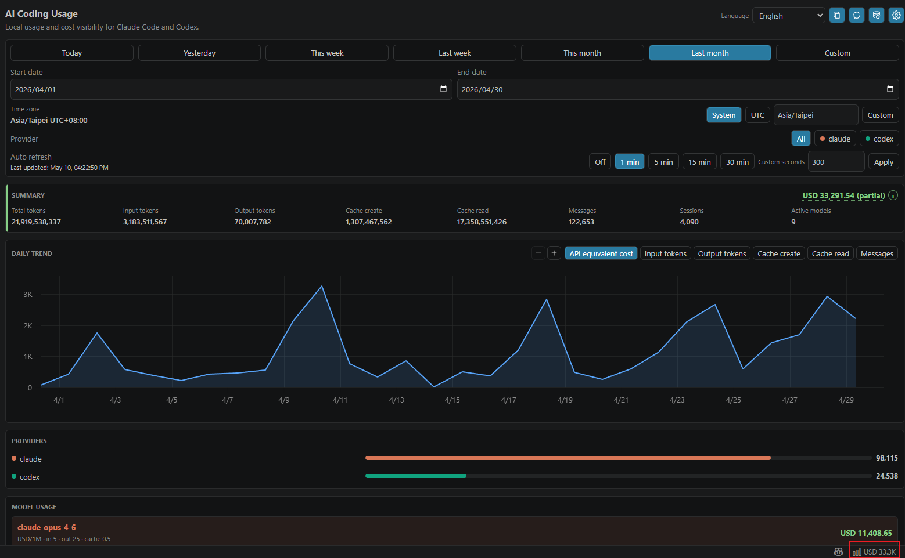
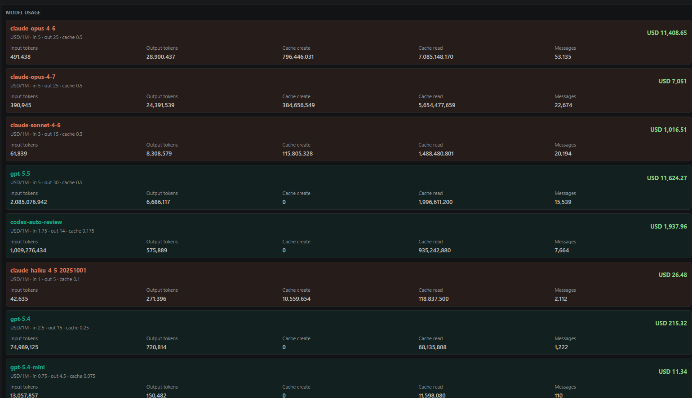
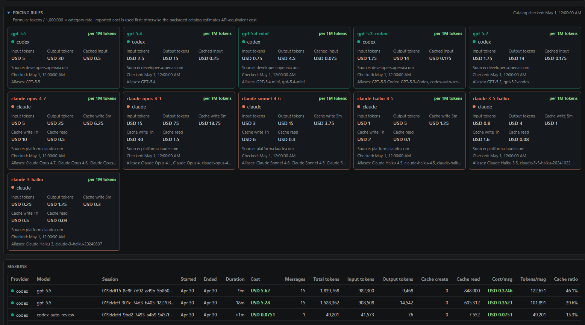

# AI Coding Usage

Track local Claude Code and Codex usage from VS Code.

Languages: [English](README.md) | [繁體中文](docs/readme/README.zh-TW.md) | [简体中文](docs/readme/README.zh-CN.md) | [日本語](docs/readme/README.ja.md) | [한국어](docs/readme/README.ko.md)

`AI Coding Usage` is a local-first VS Code extension for reviewing AI coding usage, token volume, sessions, and API-equivalent cost estimates. It reads local usage files from Claude Code and Codex, aggregates them by provider/model/session/date range, and presents the result in a VS Code dashboard and status bar summary.

## Features

- Local Claude Code and Codex usage discovery
- Provider filters for Claude, Codex, or both
- Calendar quick ranges for today, yesterday, this week, last week, this month, last month, and custom dates; week ranges start on Monday and all boundaries use the selected time zone
- Time zone selection: system time zone, UTC, or custom IANA time zone
- Model and session breakdowns with input tokens, output tokens, cache creation, cache reads, and message counts
- API-equivalent USD estimates for supported models
- Auto refresh controls with configurable intervals
- Multi-language dashboard UI: English, Traditional Chinese, Simplified Chinese, Japanese, and Korean
- Local screenshot copy support for sharing the dashboard without uploading data

## Usage

Open the dashboard in either of these ways:

- Command Palette: press `Ctrl+Shift+P` (`Cmd+Shift+P` on macOS), then run `Open AI Coding Usage`.
- Status bar: click the bottom-right `AI Usage` / cost summary item.

Useful commands:

- `Open AI Coding Usage`: open the dashboard in the editor area.
- `Refresh Usage`: rescan local usage files and refresh the dashboard.
- `Detect Local AI Usage Sources`: detect local Claude Code and Codex usage paths.
- `Open AI Coding Usage Settings`: configure usage paths, language, time zone, and auto refresh.

On first launch, leave the usage path settings empty to let the extension detect common local paths. You can also open settings and fill `aiCodingUsage.claude.usagePath` or `aiCodingUsage.codex.usagePath` manually.

## Privacy

This extension is local-only.

- No login
- No upload
- No cloud sync
- No telemetry
- No runtime network requests

The extension reads only the local usage paths you configure or approve through local source detection.

## Local Usage Sources

If these settings are empty, the extension detects common local paths and applies them automatically:

| Provider | Default path |
| --- | --- |
| Claude Code | `~/.claude/projects` |
| Codex | `~/.codex/sessions` |

On native Windows VS Code, `~` resolves to the current Windows user home, such as `C:\Users\<user>\.claude\projects` and `C:\Users\<user>\.codex\sessions`.

In Remote SSH or WSL windows, the extension runs in the remote extension host and reads the remote or WSL home directory. To inspect usage from the Windows host while working remotely, configure a path that is readable from that extension host.

## Cost Estimates

Cost values are API-equivalent estimates. They answer the question: "What would this usage roughly cost if billed through the corresponding public API pricing?"

They are not:

- A Claude Code subscription bill
- A Codex subscription bill
- A provider invoice
- A guaranteed billing statement

Pricing is calculated from the packaged pricing catalog in `src/pricing/catalog.json`. The catalog includes source URLs and `checkedAt` metadata, and `npm run check:pricing` validates the pricing metadata before packaging.

## Screenshots

The screenshots below show the dashboard across supported languages.

| Language | Overview | Details | Pricing |
| --- | --- | --- | --- |
| English |  |  |  |
| 繁體中文 |  |  |  |
| 简体中文 |  |  |  |
| 日本語 |  |  |  |
| 한국어 |  |  |  |

Screenshot guidance lives in [docs/screenshots/README.md](docs/screenshots/README.md).

## Development

```bash
npm install
npm run compile
npm test
npm run check:i18n
npm run check:privacy
npm run check:pricing
npm run check:test-data
npm run package:vsix
npm run inspect:vsix
```

`npm run package:vsix` creates a local `.vsix` package. It does not publish to Visual Studio Marketplace.

## Extension Host Testing

Open this repository in VS Code and run the `Run Extension` launch configuration.

For fixture-only testing, configure:

- `aiCodingUsage.claude.usagePath`: `test/fixtures/claude`
- `aiCodingUsage.codex.usagePath`: `test/fixtures/codex`

The dashboard webview uses `Preact`, `uPlot`, and `esbuild`. Runtime assets are packaged into `media/main.js` and `media/main.css`; the extension does not load external web assets at runtime.

## Support

See [SUPPORT.md](SUPPORT.md) for support and issue reporting guidance.

## License

MIT. See [LICENSE](LICENSE).
