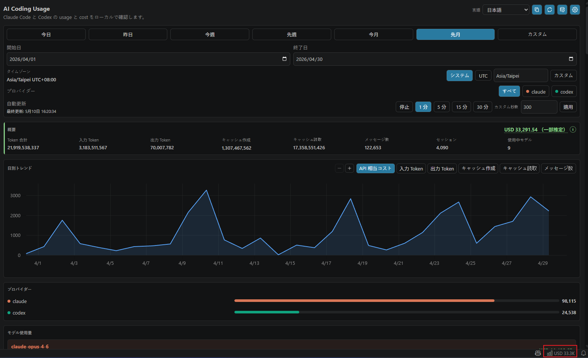
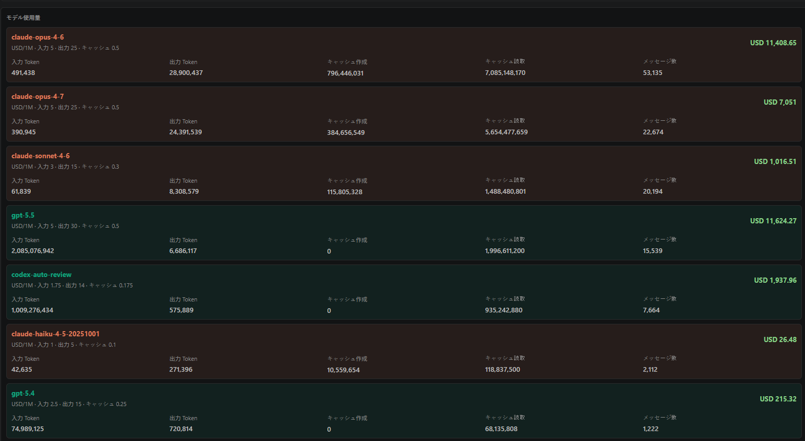
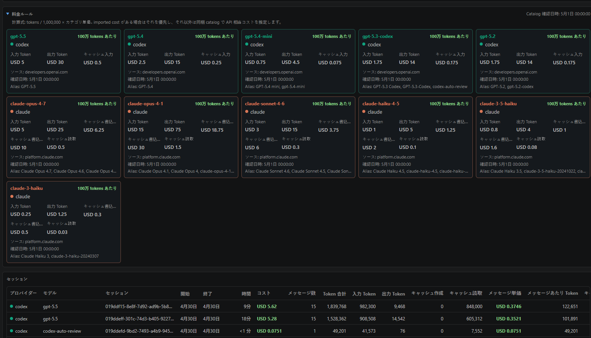

<div align="center">

<a href="https://marketplace.visualstudio.com/items?itemName=minidoracat.ai-code-usage"></a>

# AI Coding Usage

**VS Code でローカルの Claude Code と Codex の使用量を追跡します。**

[](https://marketplace.visualstudio.com/items?itemName=minidoracat.ai-code-usage)
[](https://marketplace.visualstudio.com/items?itemName=minidoracat.ai-code-usage)
[](https://github.com/Minidoracat/ai-code-usage-vscode)
[](https://discord.gg/Gur2V67)

[English](../../README.md)&nbsp;·&nbsp;[繁體中文](README.zh-TW.md)&nbsp;·&nbsp;[简体中文](README.zh-CN.md)&nbsp;·&nbsp;**日本語**&nbsp;·&nbsp;[한국어](README.ko.md)

</div>

`AI Coding Usage` は local-first な VS Code extension です。AI coding の使用量、Token 数、セッション、API 相当のコスト見積もりを確認できます。Claude Code と Codex のローカル usage files を読み取り、provider、model、session、date range ごとに集計し、VS Code dashboard と status bar summary に表示します。

## 機能

- ローカルの Claude Code と Codex の使用量ソースを検出
- Claude、Codex、または両方で provider filter
- 今日、昨日、今週、先週、今月、先月、カスタム日付範囲に対応。週範囲は月曜始まりで、すべての境界は選択した time zone で区切ります
- タイムゾーン選択：system time zone、UTC、またはカスタム IANA time zone
- モデル別・セッション別の input tokens、output tokens、cache creation、cache reads、message counts
- 対応モデルの API 相当 USD コスト見積もり
- 設定可能な auto refresh interval
- 多言語 dashboard UI：英語、繁体字中国語、簡体字中国語、日本語、韓国語
- データをアップロードせずに dashboard screenshot をローカルでコピー

## 使い方

dashboard は次のどちらかの方法で開けます。

- Command Palette：`Ctrl+Shift+P`（macOS は `Cmd+Shift+P`）を押し、`AI Coding Usage を開く` を実行します。
- 右下の status bar：`AI Usage` またはコスト概要の項目をクリックします。

よく使うコマンド：

- `AI Coding Usage を開く`：editor area に dashboard を開きます。
- `使用量を更新`：ローカル usage files を再スキャンして dashboard を更新します。
- `ローカル AI usage sources を検出`：ローカルの Claude Code と Codex usage paths を検出します。
- `AI Coding Usage 設定を開く`：usage paths、言語、time zone、auto refresh、表示通貨、スクリーンショット内容を設定します。

初回起動時は usage path settings を空のままにすると、extension が一般的なローカルパスを検出します。settings で `aiCodingUsage.claude.usagePath` または `aiCodingUsage.codex.usagePath` を手動入力することもできます。

## プライバシー

この extension は完全に local-only です。

- login なし
- upload なし
- cloud sync なし
- telemetry なし
- バックグラウンドの network requests なし

唯一のネットワークリクエストはユーザー操作によるものです。ダッシュボードの「公開レートを更新」を押すと `open.er-api.com` から為替レートを取得します（データ提供：[ExchangeRate-API](https://www.exchangerate-api.com)）。ローカルデータは一切送信せず、自動実行もされません。それ以外はすべてローカル処理です。extension は、設定済み、またはローカルソース検出で承認された usage paths のみを読み取ります。

## ローカル使用量ソース

以下の settings が空の場合、extension は一般的なローカルパスを検出して自動適用します。

| Provider | Default path |
| --- | --- |
| Claude Code | `~/.claude/projects` |
| Codex | `~/.codex/sessions` |

ネイティブ Windows VS Code では、`~` は現在の Windows user home に解決されます。例：`C:\Users\<user>\.claude\projects` と `C:\Users\<user>\.codex\sessions`。

Remote SSH または WSL のウィンドウでは、extension は remote extension host で実行され、remote または WSL の home directory を読み取ります。remote 環境で作業しながら Windows host の使用量を確認したい場合は、その extension host から読み取れるパスを設定してください。

## コスト見積もり

コスト値は API 相当の見積もりです。「この使用量が対応する public API pricing で課金された場合、おおよそいくらになるか」を確認するためのものです。

これは次のものではありません。

- Claude Code subscription bill
- Codex subscription bill
- provider invoice
- 保証された billing statement

pricing は package に含まれる `src/pricing/catalog.json` から計算されます。catalog には source URLs と `checkedAt` metadata が含まれ、`npm run check:pricing` が package 前に pricing metadata を検証します。

コストは USD で計算されます。別の通貨で表示するには、ダッシュボードの通貨行を使用します。3 文字の通貨コード（例: `TWD`）を選び、「公開レートを更新」（ユーザー操作で `open.er-api.com` から取得）を押すか、1 USD あたりのレートを手動入力してください。手動レート（`aiCodingUsage.exchangeRates` に保存）は公開レートより優先されます。レートが何もない場合は USD 表示にフォールバックします。

ページ全体のスクリーンショットコピーには、既定で料金ルールパネルとセッションテーブルが含まれません。`aiCodingUsage.screenshot.includePricing` または `aiCodingUsage.screenshot.includeSessions` で含められます。

## スクリーンショット

以下の screenshots は日本語 UI の dashboard 表示例です。







スクリーンショットのガイドは [docs/screenshots/README.md](../screenshots/README.md) にあります。

## 開発

```bash
npm install
npm run compile
npm test
npm run check:i18n
npm run check:privacy
npm run check:pricing
npm run check:test-data
npm run package:vsix
npm run inspect:vsix
```

`npm run package:vsix` はローカルの `.vsix` package を作成します。Visual Studio Marketplace には公開しません。

## Extension Host テスト

この repository を VS Code で開き、`Run Extension` launch configuration を実行します。

fixture のみでテストする場合は、次を設定してください。

- `aiCodingUsage.claude.usagePath`: `test/fixtures/claude`
- `aiCodingUsage.codex.usagePath`: `test/fixtures/codex`

dashboard webview は `Preact`、`uPlot`、`esbuild` を使用します。runtime assets は `media/main.js` と `media/main.css` に package されます。extension runtime は外部 web assets を読み込みません。

## サポート

サポートと issue 報告については [SUPPORT.md](../../SUPPORT.md) を参照してください。

## ライセンス

MIT。詳細は [LICENSE](../../LICENSE) を参照してください。
