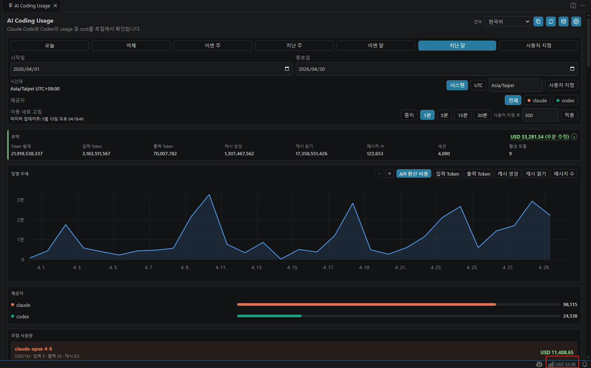
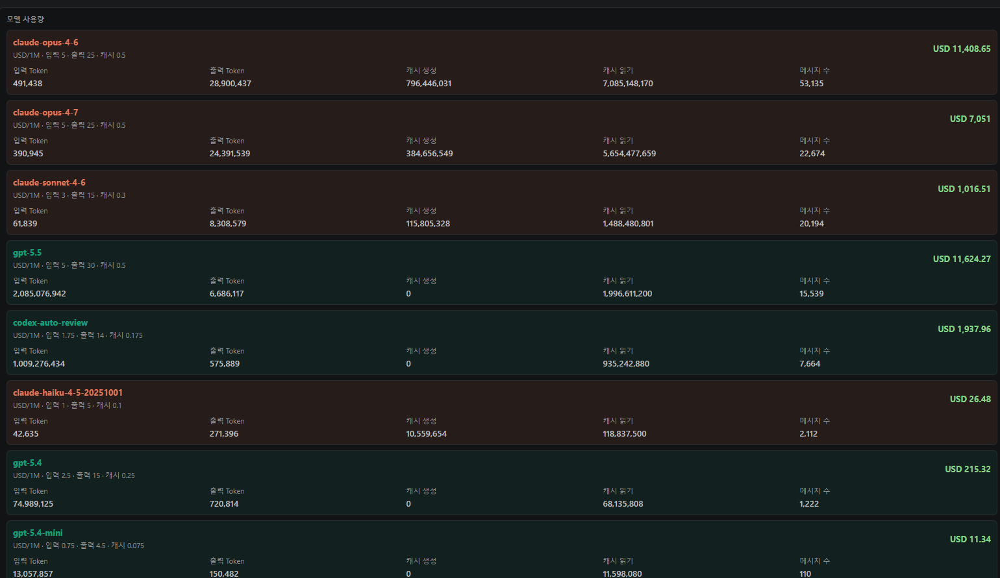
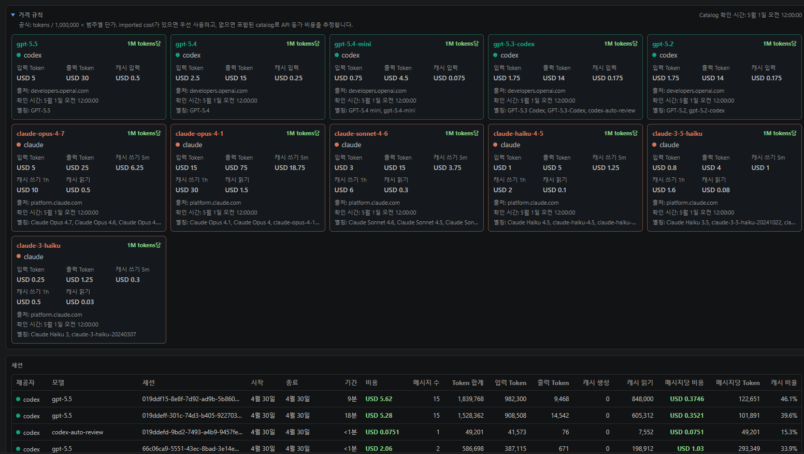

# AI Coding Usage

VS Code에서 로컬 Claude Code 및 Codex 사용량을 추적합니다.

언어: [English](../../README.md) | [繁體中文](README.zh-TW.md) | [简体中文](README.zh-CN.md) | [日本語](README.ja.md) | [한국어](README.ko.md)

`AI Coding Usage`는 local-first VS Code extension입니다. AI coding 사용량, Token 수, 세션, API 등가 비용 추정치를 확인할 수 있습니다. Claude Code와 Codex의 로컬 usage files를 읽고 provider, model, session, date range별로 집계한 뒤 VS Code dashboard와 status bar summary에 표시합니다.

## 기능

- 로컬 Claude Code 및 Codex 사용량 소스 감지
- Claude, Codex 또는 둘 다에 대한 provider filter
- 오늘, 어제, 이번 주, 지난 주, 이번 달, 지난 달, 사용자 지정 날짜 범위 지원. 주 범위는 월요일 시작이며 모든 경계는 선택한 time zone 기준으로 계산됩니다
- 시간대 선택: system time zone, UTC 또는 사용자 지정 IANA time zone
- 모델 및 세션별 input tokens, output tokens, cache creation, cache reads, message counts 표시
- 지원 모델에 대한 API 등가 USD 비용 추정
- 설정 가능한 auto refresh interval
- 다국어 dashboard UI: 영어, 번체 중국어, 간체 중국어, 일본어, 한국어
- 데이터를 업로드하지 않고 로컬에서 dashboard screenshot 복사 지원

## 사용 방법

dashboard는 다음 중 하나로 열 수 있습니다.

- Command Palette: `Ctrl+Shift+P`(macOS는 `Cmd+Shift+P`)를 누른 뒤 `AI Coding Usage 열기`를 실행합니다.
- 오른쪽 아래 status bar: `AI Usage` 또는 비용 요약 항목을 클릭합니다.

자주 쓰는 명령:

- `AI Coding Usage 열기`: editor area에 dashboard를 엽니다.
- `사용량 새로 고침`: 로컬 usage files를 다시 스캔하고 dashboard를 업데이트합니다.
- `로컬 AI usage sources 감지`: 로컬 Claude Code 및 Codex usage paths를 감지합니다.
- `AI Coding Usage 설정 열기`: usage paths, 언어, time zone, auto refresh를 설정합니다.

처음 실행할 때 usage path settings를 비워 두면 extension이 일반적인 로컬 경로를 감지합니다. settings에서 `aiCodingUsage.claude.usagePath` 또는 `aiCodingUsage.codex.usagePath`를 직접 입력할 수도 있습니다.

## 개인정보

이 extension은 완전히 local-only입니다.

- login 없음
- upload 없음
- cloud sync 없음
- telemetry 없음
- Runtime network requests 없음

extension은 사용자가 설정했거나 로컬 소스 감지로 승인한 usage paths만 읽습니다.

## 로컬 사용량 소스

아래 settings가 비어 있으면 extension은 일반적인 로컬 경로를 감지하고 자동으로 적용합니다.

| Provider | Default path |
| --- | --- |
| Claude Code | `~/.claude/projects` |
| Codex | `~/.codex/sessions` |

네이티브 Windows VS Code에서 `~`는 현재 Windows user home으로 해석됩니다. 예: `C:\Users\<user>\.claude\projects`, `C:\Users\<user>\.codex\sessions`.

Remote SSH 또는 WSL 창에서는 extension이 remote extension host에서 실행되며 remote 또는 WSL home directory를 읽습니다. remote 환경에서 작업하면서 Windows host의 사용량을 확인하려면 해당 extension host에서 읽을 수 있는 경로를 설정하세요.

## 비용 추정

비용 값은 API 등가 추정치입니다. “이 사용량이 해당 public API pricing으로 청구된다면 대략 얼마가 될까?”라는 질문에 답하기 위한 값입니다.

다음 항목이 아닙니다.

- Claude Code subscription bill
- Codex subscription bill
- provider invoice
- 보장된 billing statement

pricing은 package에 포함된 `src/pricing/catalog.json`에서 계산됩니다. catalog에는 source URLs와 `checkedAt` metadata가 포함되며, `npm run check:pricing`이 package 전에 pricing metadata를 검증합니다.

## 스크린샷

아래 screenshots는 한국어 UI의 dashboard 예시입니다.







스크린샷 가이드는 [docs/screenshots/README.md](../screenshots/README.md)에 있습니다.

## 개발

```bash
npm install
npm run compile
npm test
npm run check:i18n
npm run check:privacy
npm run check:pricing
npm run check:test-data
npm run package:vsix
npm run inspect:vsix
```

`npm run package:vsix`는 로컬 `.vsix` package를 생성합니다. Visual Studio Marketplace에 게시하지 않습니다.

## Extension Host 테스트

이 repository를 VS Code에서 열고 `Run Extension` launch configuration을 실행합니다.

fixture만 사용해 테스트하려면 다음을 설정하세요.

- `aiCodingUsage.claude.usagePath`: `test/fixtures/claude`
- `aiCodingUsage.codex.usagePath`: `test/fixtures/codex`

dashboard webview는 `Preact`, `uPlot`, `esbuild`를 사용합니다. runtime assets는 `media/main.js`와 `media/main.css`로 package됩니다. extension runtime은 외부 web assets를 로드하지 않습니다.

## 릴리스

릴리스 준비는 [docs/release.md](../release.md)에 문서화되어 있습니다.

게시에는 다음이 필요합니다.

- Marketplace publisher ID: `minidoracat`
- Marketplace `Manage` scope가 있는 Azure DevOps Personal Access Token
- GitHub environment: `marketplace-production`
- Environment secret: `VSCE_PAT`
- 명시적인 GitHub Release 또는 explicit publish confirmation이 포함된 manual workflow dispatch

publish workflow는 게시 전에 모든 release gates를 다시 실행하도록 설계되어 있습니다. 로컬 테스트나 수동 Marketplace checklist를 건너뛰는 용도로 사용하면 안 됩니다.

## 지원

지원 및 issue 보고 방법은 [SUPPORT.md](../../SUPPORT.md)를 참고하세요.

## 라이선스

MIT. 자세한 내용은 [LICENSE](../../LICENSE)를 참고하세요.
