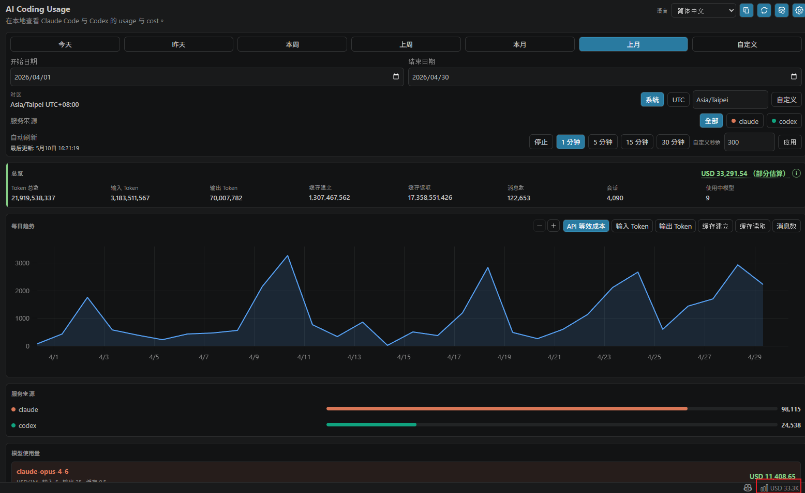
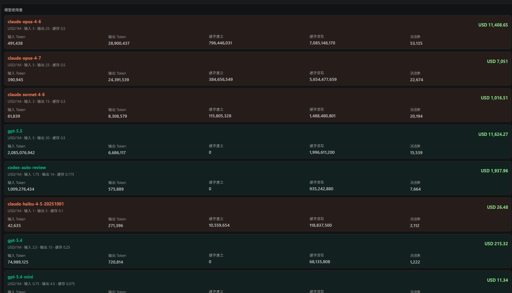
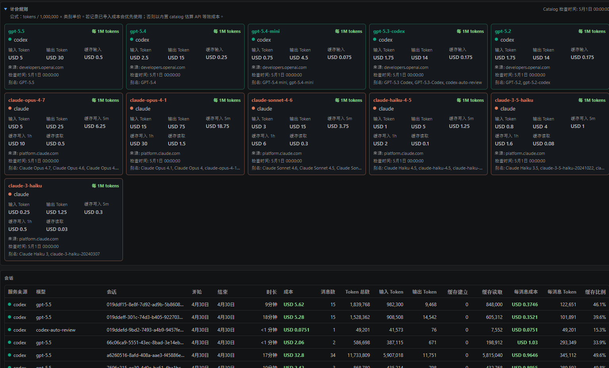

# AI Coding Usage

在 VS Code 中追踪本机 Claude Code 和 Codex 使用量。

语言：[English](../../README.md) | [繁體中文](README.zh-TW.md) | [简体中文](README.zh-CN.md) | [日本語](README.ja.md) | [한국어](README.ko.md)

`AI Coding Usage` 是 local-first 的 VS Code extension，用于查看 AI coding 使用量、Token 数量、会话，以及 API 等效成本估算。它会读取 Claude Code 和 Codex 的本机 usage files，按 provider、model、session、date range 汇总，并在 VS Code dashboard 和 status bar summary 中展示结果。

## 功能

- 发现本机 Claude Code 和 Codex 使用量来源
- 可筛选 Claude、Codex 或两者
- 支持今天、昨天、本周、上周、本月、上月和自定义日期范围；周范围从周一开始，所有边界按所选时区切分
- 支持时区选择：系统时区、UTC 或自定义 IANA time zone
- 按模型和会话展示 input tokens、output tokens、cache creation、cache reads 和 message counts
- 针对支持的模型提供 API 等效 USD 成本估算
- 可配置 auto refresh interval
- 多语言 dashboard UI：英文、繁体中文、简体中文、日文、韩文
- 支持本机复制 dashboard 截图，不会上传数据

## 使用方法

可以用以下任一方式打开 dashboard：

- Command Palette：按 `Ctrl+Shift+P`（macOS 为 `Cmd+Shift+P`），运行 `打开 AI Coding Usage`。
- 右下角 status bar：点击 `AI Usage` 或成本摘要项目。

常用命令：

- `打开 AI Coding Usage`：在 editor area 打开 dashboard。
- `刷新使用量`：重新扫描本机 usage files 并更新 dashboard。
- `检测本地 AI 使用量来源`：检测本机 Claude Code 和 Codex usage paths。
- `打开 AI Coding Usage 设置`：配置 usage paths、语言、时区和 auto refresh。

第一次启动时，可以先让 usage path settings 保持为空，extension 会检测常见本机路径。也可以在 settings 手动填入 `aiCodingUsage.claude.usagePath` 或 `aiCodingUsage.codex.usagePath`。

## 隐私

这个 extension 完全 local-only。

- 不需要 login
- 不上传数据
- 不做 cloud sync
- 不收集 telemetry
- Runtime 不发起 network requests

extension 只会读取你配置或通过本机来源检测批准的 usage paths。

## 本机使用量来源

如果以下 settings 为空，extension 会检测常见本机路径并自动应用：

| Provider | 默认路径 |
| --- | --- |
| Claude Code | `~/.claude/projects` |
| Codex | `~/.codex/sessions` |

在原生 Windows VS Code 中，`~` 会解析为当前 Windows user home，例如 `C:\Users\<user>\.claude\projects` 和 `C:\Users\<user>\.codex\sessions`。

在 Remote SSH 或 WSL 窗口中，extension 会在 remote extension host 中运行，并读取 remote 或 WSL 的 home directory。如果你在 remote 环境工作，但想查看 Windows host 的使用量，请配置 extension host 可读取的路径。

## 成本估算

成本值是 API 等效估算，用来回答：“如果这些用量通过相应的 public API pricing 计费，大约会花多少钱？”

它不是：

- Claude Code subscription bill
- Codex subscription bill
- provider invoice
- 保证准确的 billing statement

pricing 来自 package 内的 `src/pricing/catalog.json`。catalog 包含 source URLs 和 `checkedAt` metadata，并由 `npm run check:pricing` 在 package 前验证 pricing metadata。

## 截图

以下 screenshots 展示 dashboard 在简体中文界面的画面。







截图指引见 [docs/screenshots/README.md](../screenshots/README.md)。

## 开发

```bash
npm install
npm run compile
npm test
npm run check:i18n
npm run check:privacy
npm run check:pricing
npm run check:test-data
npm run package:vsix
npm run inspect:vsix
```

`npm run package:vsix` 会创建本机 `.vsix` package，不会发布到 Visual Studio Marketplace。

## Extension Host 测试

在 VS Code 中打开此 repository，运行 `Run Extension` launch configuration。

如果只想使用 fixture 测试，请配置：

- `aiCodingUsage.claude.usagePath`: `test/fixtures/claude`
- `aiCodingUsage.codex.usagePath`: `test/fixtures/codex`

dashboard webview 使用 `Preact`、`uPlot` 和 `esbuild`。runtime assets 会 package 到 `media/main.js` 和 `media/main.css`；extension runtime 不会加载外部 web assets。

## 发布

发布准备流程记录在 [docs/release.md](../release.md)。

发布需要：

- Marketplace publisher ID：`minidoracat`
- Azure DevOps Personal Access Token，scope 为 Marketplace `Manage`
- GitHub environment：`marketplace-production`
- Environment secret：`VSCE_PAT`
- 明确的 GitHub Release，或带有 explicit publish confirmation 的 manual workflow dispatch

publish workflow 会在发布前重新运行所有 release gates。它不能用来跳过本机测试或手动 Marketplace checklist。

## 支持

请见 [SUPPORT.md](../../SUPPORT.md) 了解支持和 issue 报告方式。

## 许可证

MIT。请见 [LICENSE](../../LICENSE)。
