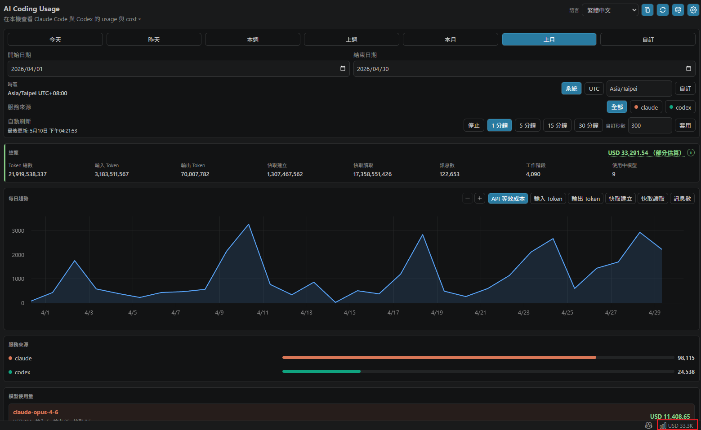
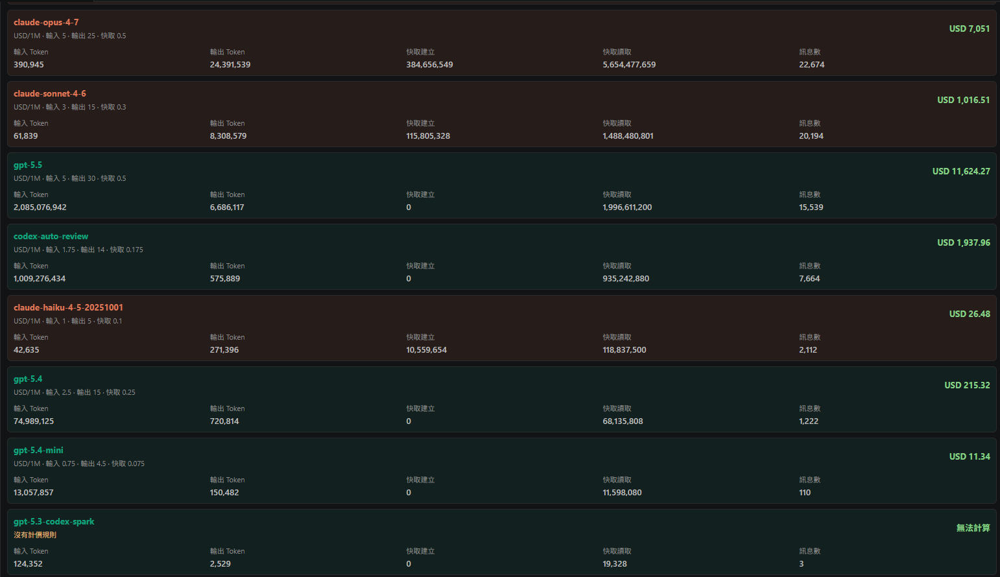
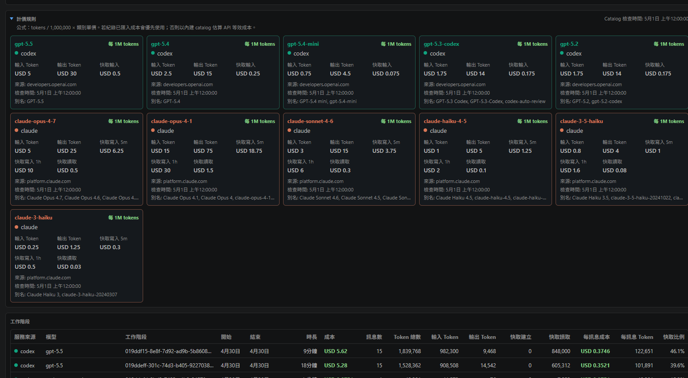

# AI Coding Usage

在 VS Code 中追蹤本機 Claude Code 與 Codex 使用量。

語言：[English](../../README.md) | [繁體中文](README.zh-TW.md) | [简体中文](README.zh-CN.md) | [日本語](README.ja.md) | [한국어](README.ko.md)

`AI Coding Usage` 是 local-first 的 VS Code extension，用來檢視 AI coding 使用量、Token 量、工作階段，以及 API 等效成本估算。它會讀取 Claude Code 與 Codex 的本機 usage files，依 provider、model、session、date range 彙整，並在 VS Code dashboard 與 status bar summary 中呈現結果。

## 功能

- 偵測本機 Claude Code 與 Codex 使用量來源
- 可篩選 Claude、Codex 或兩者
- 支援今天、昨天、本週、上週、本月、上月與自訂日期範圍；週範圍從週一開始，所有邊界依所選時區切分
- 支援時區選擇：系統時區、UTC 或自訂 IANA time zone
- 依模型與工作階段顯示 input tokens、output tokens、cache creation、cache reads 與 message counts
- 針對支援模型提供 API 等效 USD 成本估算
- 可設定 auto refresh interval
- 多語系 dashboard UI：英文、繁體中文、簡體中文、日文、韓文
- 支援本機複製 dashboard 截圖，不會上傳資料

## 使用方法

可以用以下任一方式開啟 dashboard：

- Command Palette：按 `Ctrl+Shift+P`（macOS 為 `Cmd+Shift+P`），執行 `開啟 AI Coding Usage`。
- 右下角 status bar：點擊 `AI Usage` 或成本摘要項目。

常用命令：

- `開啟 AI Coding Usage`：在 editor area 開啟 dashboard。
- `重新整理使用量`：重新掃描本機 usage files 並更新 dashboard。
- `偵測本機 AI 使用量來源`：偵測本機 Claude Code 與 Codex usage paths。
- `開啟 AI Coding Usage 設定`：設定 usage paths、語言、時區與 auto refresh。

第一次啟動時，可以先讓 usage path settings 保持空白，extension 會偵測常見本機路徑。也可以在 settings 手動填入 `aiCodingUsage.claude.usagePath` 或 `aiCodingUsage.codex.usagePath`。

## 隱私

這個 extension 完全 local-only。

- 不需要 login
- 不上傳資料
- 不做 cloud sync
- 不收集 telemetry
- Runtime 不發出 network requests

extension 只會讀取你設定或透過本機來源偵測核准的 usage paths。

## 本機使用量來源

如果以下 settings 留空，extension 會偵測常見本機路徑並自動套用：

| Provider | 預設路徑 |
| --- | --- |
| Claude Code | `~/.claude/projects` |
| Codex | `~/.codex/sessions` |

在原生 Windows VS Code 中，`~` 會解析為目前 Windows user home，例如 `C:\Users\<user>\.claude\projects` 與 `C:\Users\<user>\.codex\sessions`。

在 Remote SSH 或 WSL 視窗中，extension 會在 remote extension host 執行，並讀取 remote 或 WSL 的 home directory。若你在 remote 環境工作，但想檢視 Windows host 的使用量，請設定 extension host 可讀取的路徑。

## 成本估算

成本值是 API 等效估算，用來回答：「如果這些用量透過相對應的 public API pricing 計費，大約會花多少？」

它不是：

- Claude Code subscription bill
- Codex subscription bill
- provider invoice
- 保證正確的 billing statement

pricing 來自 package 內的 `src/pricing/catalog.json`。catalog 包含 source URLs 與 `checkedAt` metadata，並由 `npm run check:pricing` 在 package 前驗證 pricing metadata。

## 截圖

以下 screenshots 展示 dashboard 在繁體中文介面的畫面。







截圖指引請見 [docs/screenshots/README.md](../screenshots/README.md)。

## 開發

```bash
npm install
npm run compile
npm test
npm run check:i18n
npm run check:privacy
npm run check:pricing
npm run check:test-data
npm run package:vsix
npm run inspect:vsix
```

`npm run package:vsix` 會建立本機 `.vsix` package，不會發布到 Visual Studio Marketplace。

## Extension Host 測試

在 VS Code 開啟此 repository，執行 `Run Extension` launch configuration。

如果只想用 fixture 測試，請設定：

- `aiCodingUsage.claude.usagePath`: `test/fixtures/claude`
- `aiCodingUsage.codex.usagePath`: `test/fixtures/codex`

dashboard webview 使用 `Preact`、`uPlot` 與 `esbuild`。runtime assets 會 package 到 `media/main.js` 與 `media/main.css`；extension runtime 不會載入外部 web assets。

## 發布

發布準備流程記錄於 [docs/release.md](../release.md)。

發布需要：

- Marketplace publisher ID：`minidoracat`
- Azure DevOps Personal Access Token，scope 為 Marketplace `Manage`
- GitHub environment：`marketplace-production`
- Environment secret：`VSCE_PAT`
- 明確的 GitHub Release，或帶有 explicit publish confirmation 的 manual workflow dispatch

publish workflow 會在發布前重新執行所有 release gates。它不能用來跳過本機測試或手動 Marketplace checklist。

## 支援

請見 [SUPPORT.md](../../SUPPORT.md) 了解支援與 issue 回報方式。

## 授權

MIT。請見 [LICENSE](../../LICENSE)。
